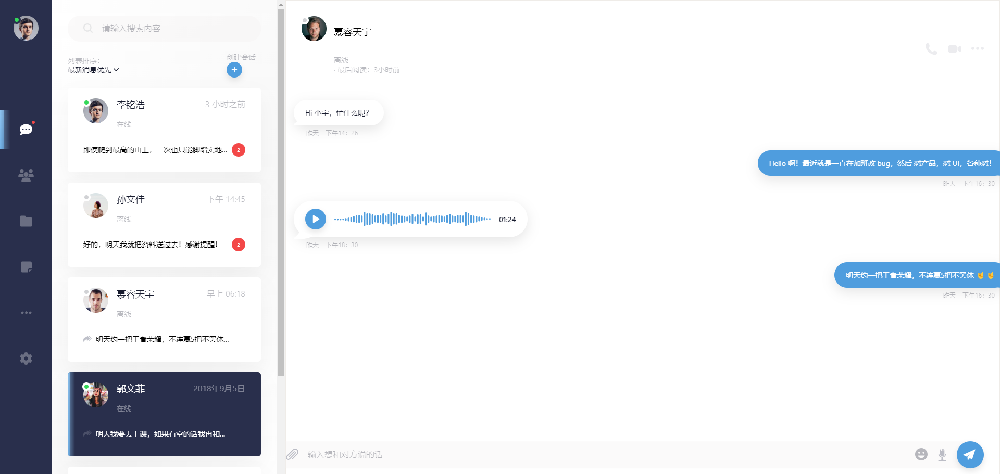
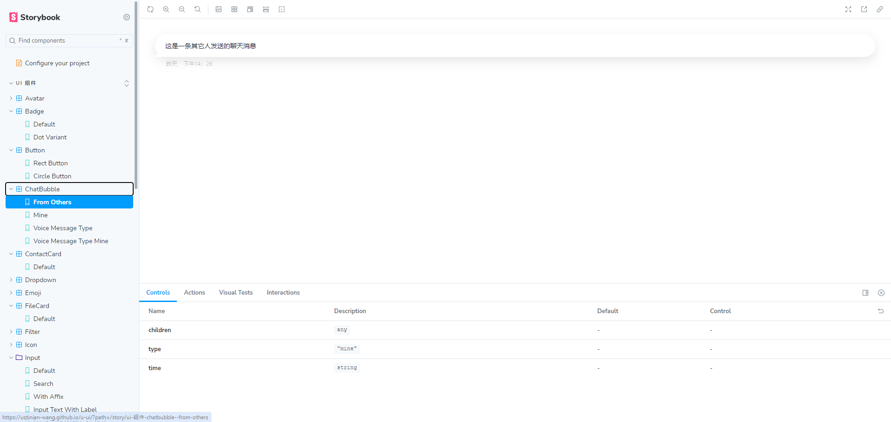

# U-UI

## Introduction

U-UI is a component library and application designed for instant messaging (IM) software, built using the React ecosystem.

## Prerequisites

- Node.js version 20.14.0 or higher

## Application

U-UI offers a partially implemented IM application. You can view an example below:

### Scripts

- **Develop:** `yarn react-scripts start` - Starts the development server.
- **Build:** `yarn build` - Builds the application for production.
- **Preview Storybook:** `yarn storybook` - Launches Storybook for component development and testing.

## Components

U-UI provides a comprehensive set of components for IM development and will soon support npm package distribution.

### Installation

*Details to be provided...*

## Documentation

- [U-UI Documentation](https://ustinian-wang.github.io/u-ui/)
- [GitHub Repository](https://github.com/ustinian-wang/u-ui)