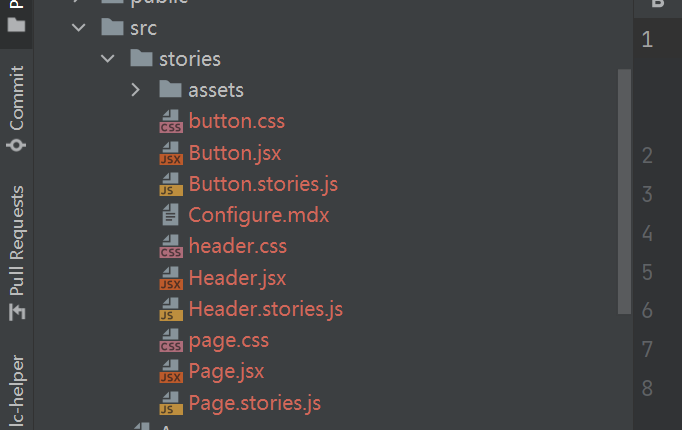
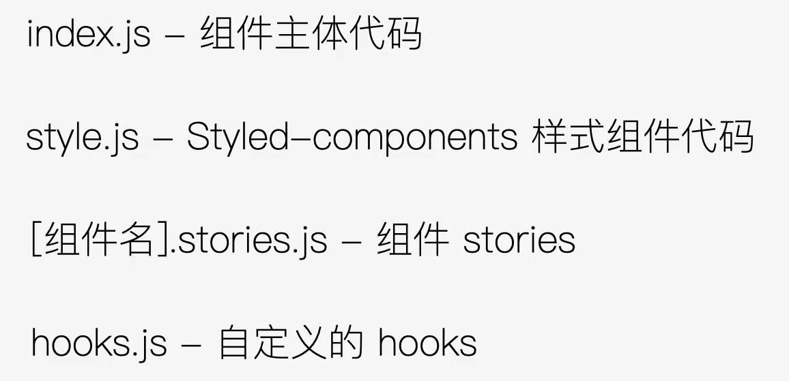

## storybook


>  install

`npx -p @storybook/cli sb init`

自动生成如下文档



## components

### structure



## jsconfig

> 优化路径的繁琐引用

不过好像没啥效果

## hygen

有些代码可能会有重复的模板，可以把这些集成起来，方便下次使用

> 初始化模板

`hygen init self`一般会常出现如下
```shell
       added: _templates/generator/help/index.ejs.t
       added: _templates/generator/with-prompt/hello.ejs.t
       added: _templates/generator/with-prompt/prompt.ejs.t
       added: _templates/generator/new/hello.ejs.t
       added: _templates/init/repo/new-repo.ejs.t

```

> 创建模板

```shell
$ hygen generator new component

Loaded templates: C:\Users\jser\Desktop\gitDemo\u-ui\_templates
       added: _templates/component/new/hello.ejs.t

```

然后你可以删除模板，写你要的内容

> 使用模板

```shell
$ hygen component new Icon

Loaded templates: C:\Users\jser\Desktop\gitDemo\u-ui\_templates
       added: src/components/Icon/index.js
       added: src/components/Icon/icon.stories.js
       added: src/components/Icon/style.js

```

